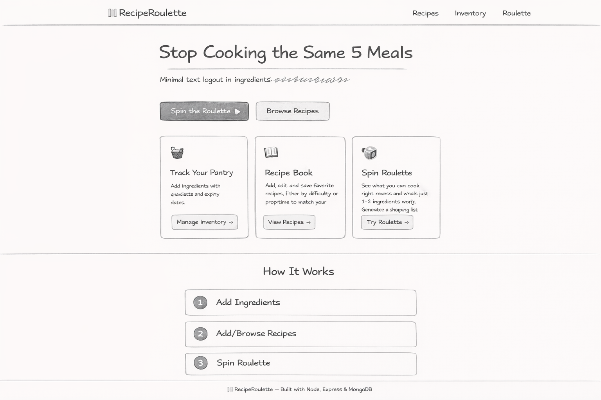
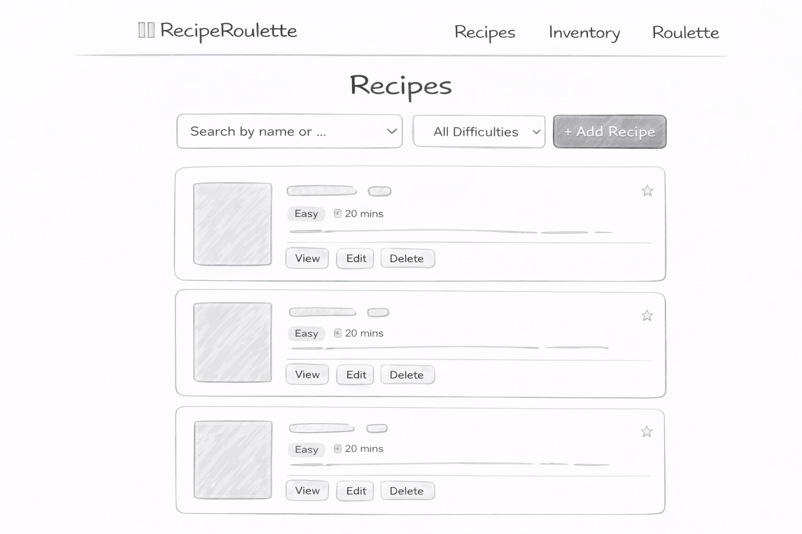
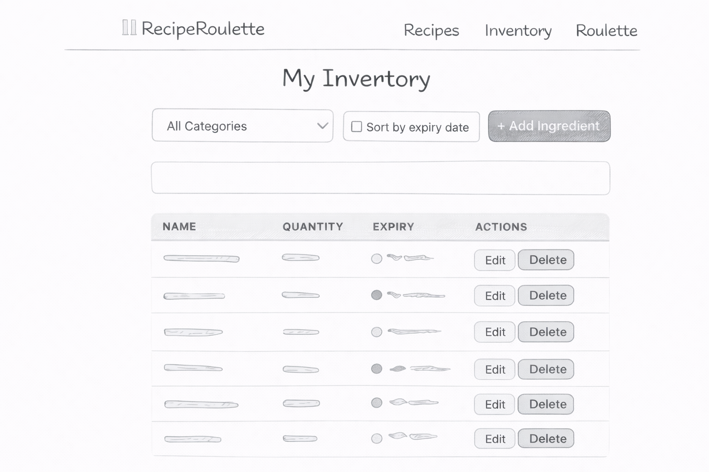
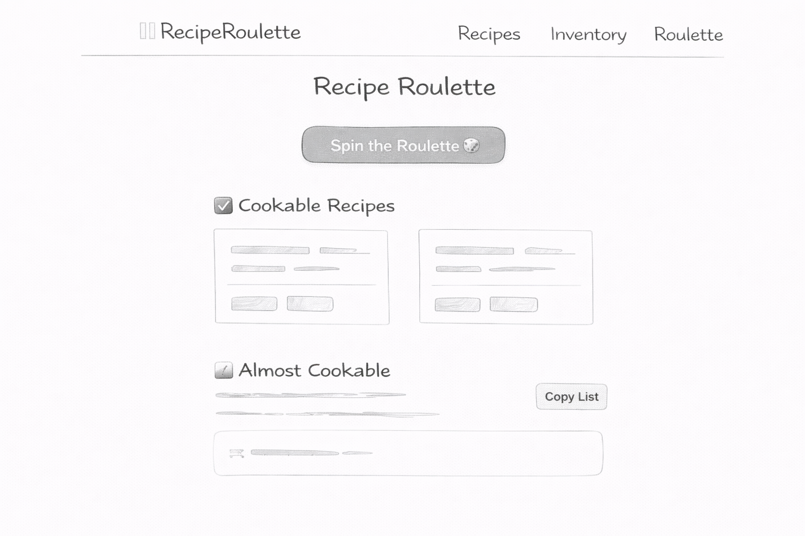

# 🍽️ RecipeRoulette – Design Document  

**Author:** Navanika Reddy,Abdullah Basarvi
**Course:** Web Development  
**Project Type:** Full-Stack Web Application  
**Tech Stack:** Node.js, Express, MongoDB (Node Driver), Vanilla ES6 JavaScript, HTML5, CSS3  

---

## 1️⃣ Project Description  

RecipeRoulette is a full-stack web application designed to help users avoid cooking the same meals repeatedly and reduce food waste.  

The application allows users to:

- Maintain a virtual kitchen inventory  
- Add and manage recipes  
- Discover which recipes can be made using available ingredients  
- Identify ingredients that are close to expiration  
- Generate a shopping list for missing ingredients  

The main goal of RecipeRoulette is to solve meal monotony while reducing grocery waste.

The application uses:

- **Node.js + Express** for backend routing  
- **MongoDB Atlas** for database storage  
- **Vanilla JavaScript (ES6 Modules)** for client-side rendering  
- **Two MongoDB collections:**  
  - `recipes`  
  - `inventory`  

No frontend frameworks or ORMs were used.

---

## 2️⃣ User Personas  

### 👩 Persona 1: Busy Parent – “Maria”  

**Background:**  
Maria works full-time and has limited time for meal planning.

**Goals:**
- Quickly see what meals can be prepared
- Avoid wasting groceries
- Reduce takeout expenses

**Pain Points:**
- Ingredients expiring unnoticed
- Not knowing what to cook
- Limited prep time

**How RecipeRoulette Helps:**
- Shows cookable recipes instantly
- Highlights expiring ingredients
- Filters recipes by prep time and difficulty

---

### 👨 Persona 2: College Student – “Dev”  

**Background:**  
Dev shares an apartment and has limited cooking resources.

**Goals:**
- Cook affordable meals
- Use shared fridge ingredients
- Avoid unnecessary grocery purchases

**Pain Points:**
- Small budget
- Limited ingredients
- Basic cooking experience

**How RecipeRoulette Helps:**
- Suggests recipes based on available ingredients
- Displays missing ingredients clearly
- Simple and beginner-friendly UI

---

### 🥗 Persona 3: Meal Prep Enthusiast – “Taylor”  

**Background:**  
Taylor buys groceries in bulk and prepares meals weekly.

**Goals:**
- Track ingredients efficiently
- Plan meals in advance
- Avoid spoilage

**Pain Points:**
- Forgetting what’s in stock
- Ingredients expiring before use

**How RecipeRoulette Helps:**
- Sorts ingredients by expiration date
- Displays color-coded expiration warnings
- Shows recipe compatibility instantly

---

## 3️⃣ User Stories  

### 🍳 Recipe Management  

- As a user, I want to add recipes with title, ingredients, prep time, and difficulty so I can build my collection.
- As a user, I want to edit or delete recipes so I can refine my collection.
- As a user, I want to filter recipes by difficulty and prep time so I can cook according to my schedule.
- As a user, I want to search recipes by name or ingredient so I can quickly find what I need.
- As a user, I want to mark recipes as favorites so I can quickly access preferred meals.

---

### 🧺 Inventory Management  

- As a user, I want to add ingredients with quantity and expiration date so I can track my kitchen stock.
- As a user, I want to edit quantities so my inventory remains accurate.
- As a user, I want to delete ingredients once used.
- As a user, I want ingredients sorted by expiration date to prioritize usage.
- As a user, I want visual expiration warnings:
  - 🔴 Red for ≤ 3 days  
  - 🟡 Yellow for ≤ 7 days  

---

### 🎯 Recipe Matching & Shopping  

- As a user, I want to see which recipes I can cook immediately.
- As a user, I want to see recipes missing only 1–2 ingredients.
- As a user, I want to generate a shopping list for missing ingredients.

---

## 4️⃣ Application Structure  

### 📂 Backend (`server/`)

- `server.js` – Express entry point  
- `db/database.js` – MongoDB connection module  
- `routes/recipes.js` – CRUD routes for recipes  
- `routes/inventory.js` – CRUD routes for inventory  

### 📂 Frontend (`public/`)

- `index.html`
- `recipes.html`
- `inventory.html`
- `roulette.html`
- `shopping.html`
- `dashboard.html`

### 📂 JavaScript Modules (`public/js/`)
- `recipes.js`
- `inventory.js`
- `roulette.js`
- `api.js`

### 📂 CSS Modules (`public/css/`)
- `recipes.css`
- `inventory.css`
- `roulette.css`
- `global.css`

The application follows modular organization for maintainability and clarity.

---

## 5️⃣ Design Mockups 
### 🧾 Home Page

### 🧾 Recipes Page

### 🧾 Inventory Page

### 🎰 Roulette Page

---

## 6️⃣ Technical Architecture  

- Backend uses **ES Modules (no CommonJS require)**
- MongoDB Node Driver (no Mongoose)
- REST API endpoints:
  - `/api/recipes`
  - `/api/inventory`
- Client-side rendering using `fetch`
- Modular JS architecture
- ESLint configuration included
- Prettier formatting enforced
- MIT License included
- Environment variables stored securely in `.env`
- No secret credentials committed to GitHub

---

## 7️⃣ Usability & Accessibility  

- Semantic HTML elements used
- Proper form components (no misuse of div/span as buttons)
- Clear navigation between pages
- Responsive layout using CSS modules
- Minimal and clean interface
- Beginner-friendly user experience

---
