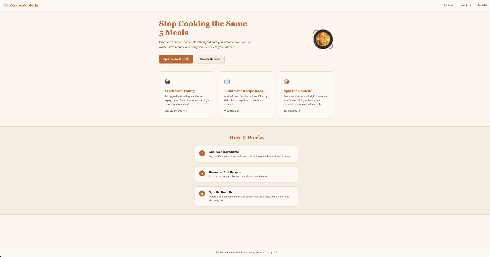
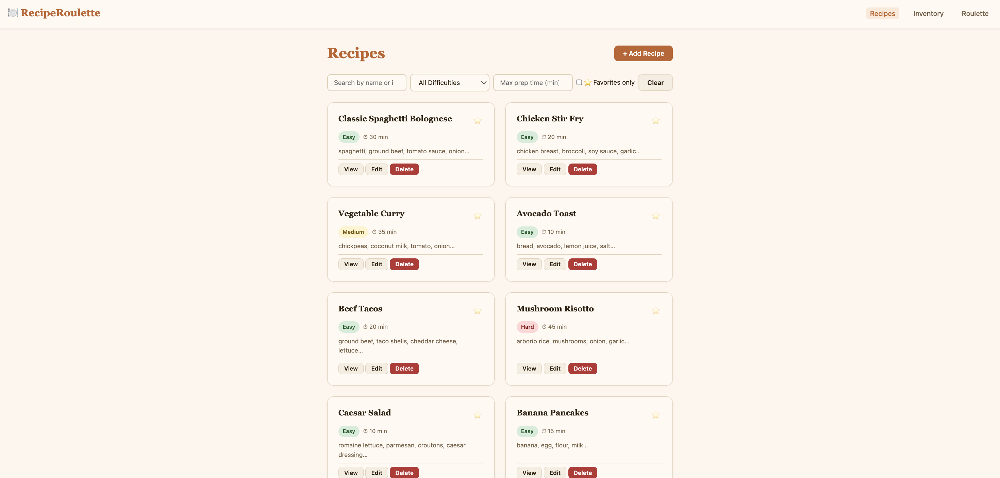
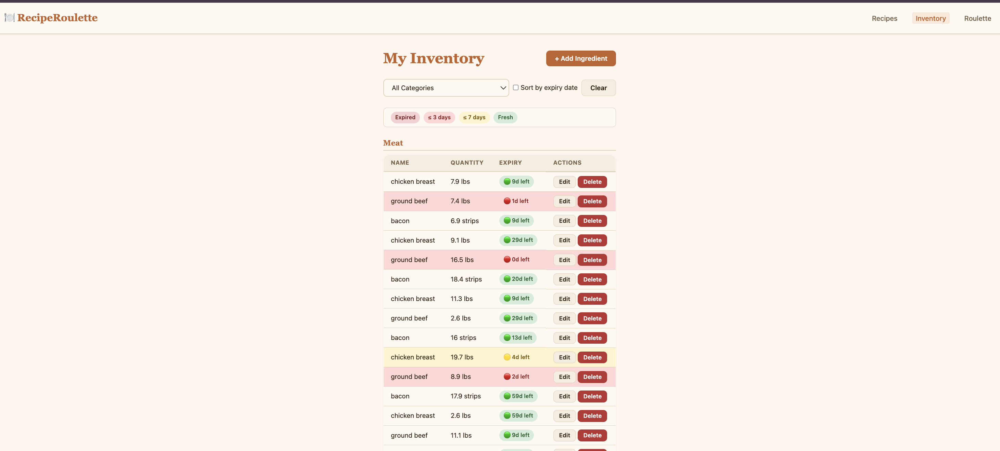
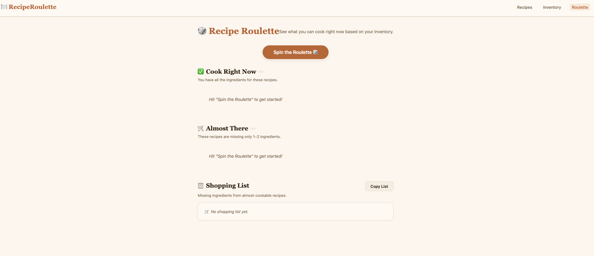

# 🍳 RecipeRoulette

## Author
Navanika Reddy , Abdullah Basarvi

## Course
Web Development – Northeastern University  

---

## 📌 Project Objective

RecipeRoulette is a full-stack web application designed to help users stop cooking the same meals repeatedly and reduce food waste.  

The application allows users to manage both their **recipes** and **ingredient inventory**, then intelligently determine:

- What recipes can be cooked immediately  
- Which recipes are missing only 1–2 ingredients  
- What ingredients need to be purchased  
- How close ingredients are to expiration  

The project demonstrates full-stack development using **Node.js, Express, MongoDB, and Vanilla JavaScript (ES6 Modules)** while following clean architecture, modular organization, and modern web development best practices.

---

## 🧱 Tech Stack

- **Backend:** Node.js + Express  
- **Database:** MongoDB (Node.js Driver, no Mongoose)  
- **Frontend:** HTML5, CSS3, Vanilla ES6 JavaScript  
- **Architecture:** Modular JS, separated routes, DB connector module  
- **Code Quality:** ESLint + Prettier  

---

## 🚀 Core Features

### 🍲 Recipe Management
- Add recipes (title, ingredients, instructions, prep time, difficulty)
- Edit and delete recipes
- Mark recipes as favorites
- Filter by difficulty and prep time
- Search by name or ingredient

### 🥕 Inventory Management
- Add ingredients with quantity, category, and expiration date
- Edit and delete ingredients
- Visual expiration warnings:
  - Expired
  - ≤ 3 days
  - ≤ 7 days
  - Fresh
- Sort by category or expiration date

### 🎲 Recipe Roulette
- Shows recipes that can be cooked immediately
- Shows recipes missing only 1–2 ingredients
- Automatically generates a shopping list
- Copy shopping list functionality

---

## 📸 Screenshots

### Homepage


### Recipes Page


### Inventory Page


### Recipe Roulette Page


---

## 🛠️ How to Build and Run Locally

### 1️⃣ Clone the Repository

```bash
git clone https://github.com/navanika2211/recipe-roulette.git
cd recipe-roulette
